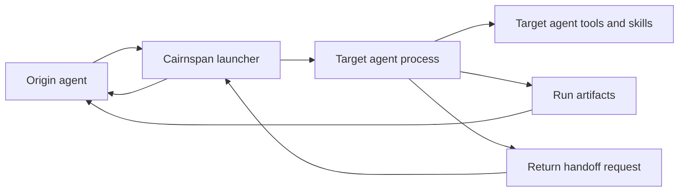

# Cairnspan Plan

## Product Thesis

Cairnspan's north star is governed multi-agent interaction across different
models and local AI clients. The product should route bounded tasks to the
agent with the best capability, context, account access, tool setup, cost
profile, or model strength, then return a receipt the origin can trust.

Claude Code and Codex are the first proof pair. They are useful in different
ways, so Cairnspan should let either one delegate a bounded task to the
other through the user's existing OAuth-backed local agent sessions without
pretending they share context, tools, approvals, auth, or runtime state.

The key wedge is OAuth-backed access. If a workflow can be solved by directly calling the OpenAI or Anthropic API with an API key, that is not enough to justify this product. Cairnspan is useful when the user wants the target agent's installed client, account session, included capabilities, skills, MCP setup, image generation, or workspace-governed access to do the work.

The product succeeds when a handoff can answer:

- Who asked?
- Which agent ran?
- What command or entrypoint was used?
- What permissions were granted?
- What thread/session id was created?
- What logs and artifacts prove the result?
- What should the originating agent do next?

## Name

Selected working public name: **Cairnspan** / `cairnspan`.

The private-alpha source migration uses a clean break: paths, runtime
directories, schemas, tests, receipts, protocol markers, and environment
prefixes use `Cairnspan`, `cairnspan`, `.cairnspan`, and `CAIRNSPAN_*` without
runtime compatibility aliases. Historical ignored receipts are not rewritten.
A developer's local checkout folder label is host state, not part of the
runtime or distribution contract. `docs/name-check.md` records the decision,
caveats, rejected alternatives, and migration outcome.

## Scope

In scope:

- Claude Code launching Codex for Codex-only capabilities.
- Codex producing structured handoff requests back to Claude Code.
- OAuth-backed local agent sessions as the default path.
- Capturing request, redacted command, stdout/stderr or JSONL, final result, thread id, return code, and blockers.
- Capability probes for image generation, MCP tools, commit path, auth, and scheduler behavior.
- Internal product website design, implementation, image-generation,
  image-viewing, and finite artifact-batch handoffs, after separate
  synthetic capability and batch gates pass.
- Keeping runtime logs out of product commits by default and redacting evidence before sharing.

Out of scope for MVP:

- Pretending Claude Code and Codex share the same tool runtime.
- Raw API-only orchestration as the primary product.
- Copying, storing, or brokering OAuth tokens directly.
- Browser or desktop UI automation as the primary coordination path.
- Pushing code or publishing packages.
- Running destructive commands.
- Full production orchestration without a launchable CLI entrypoint for both agents.

## Architecture

## Capability Roadmap

Phase 1 is the verified two-agent control proof:

- Claude Code can launch Codex through Cairnspan.
- Codex can launch Claude Code through Cairnspan.
- Both directions produce receipts.
- A full two-way loop uses the bounded parent-orchestrated contract in `docs/two-way-loop.md` to prove that one target's verified artifact becomes the next target's input.
- Safety gates cover sandbox behavior, strict tool/MCP behavior, no-edit manifests, artifact scanning, output-path safety, and recursion guards.

Phase 2 is the main product direction: a governed multi-agent capability
orchestrator.

- One origin/orchestrator can route bounded tasks to at least two target agents,
  initially Codex, Claude Code, and a Cursor or Gemini feasibility adapter.
- Routing is policy-driven, not model whim: each target adapter declares capabilities, allowed data classes, allowed tools, cost limits, workspace scope, and output contract.
- The orchestrator does not create pairwise bridges between every agent pair. It uses one adapter contract and one receipt contract.
- Phase 2 is not started until Phase 1 is repeatable and the enterprise safety gates in `docs/threat-model.md` are represented in tests.

Enterprise posture:

- Treat every target agent as a separate vendor boundary.
- Treat every handoff as a data egress event, even in read-only mode.
- Default to deny for tools, MCP, network, write access, broad raw args, recursive delegation, and outside-workspace output.
- Preserve auditability: every routing decision, policy decision, permission scope, target capability, and artifact digest should be reconstructable from receipts.

## Direction 1: Claude Code To Codex

Status: verified end to end from a Claude Code origin for basic text, read-only
no-edit, workspace-write boundary, MCP visibility, native image attachments,
and historical built-in Codex image generation using explicit local Codex CLI
paths. The historical image-generation pass does not establish current
`0.144.0-alpha.4` `$imagegen` or `view_image` compatibility; current probes must
use the additive image-capability receipt gate.

Flow:

1. Claude Code reads `.claude/skills/cairnspan/SKILL.md`.
2. Claude Code writes a request file and calls `skills/cairnspan/scripts/start_codex_session.py`.
3. The script launches `codex exec --json`.
4. The script writes `events.jsonl`, `transcript.log`, `final.md`, and `cairnspan-summary.json`.
5. Claude Code reads the summary and decides whether the Codex run succeeded.

Current blocker:

- Default `codex` PATH resolution still finds the WindowsApps packaged executable, which returns `Access is denied` when launched from unattended subprocesses.
- A launchable Codex CLI exists at `<launchable-codex.exe>`; use it with `--codex-bin` until PATH is fixed.

## Direction 2: Codex To Claude Code

Status: Claude Code noninteractive entrypoint discovered, launcher implemented, and Codex-origin basic plus strict-MCP/no-tools/no-edit live probes succeeded. The bounded parent-orchestrated text route is also live-verified.

Target flow:

1. Codex identifies work that should be handled by Claude Code.
2. Codex writes a prompt file for Claude Code.
3. Cairnspan launches Claude Code with `claude -p --output-format stream-json`.
4. Cairnspan captures Claude's JSON stream, transcript, final result, session id, usage, and failure class.
5. Codex reads the artifacts and decides the next step.
6. If live launch is unavailable, Codex writes a structured mailbox request under `.cairnspan/requests` for later Claude Code handling.

Verified entrypoint:

- `claude -p --output-format json --permission-mode dontAsk --tools "" --no-session-persistence --max-budget-usd 0.10` returned `claude-cairnspan-ok` with return code 0 from Codex on 2026-07-08.
- Do not use `--bare` for the default OAuth-backed path because local help says it bypasses OAuth/keychain auth.
- `stream-json` requires `--verbose`.
- `--tools ""` still allowed configured Claude MCP tools to appear in an early stream init event, so the launcher now defaults to `--strict-mcp-config`. The 2026-07-10 hardened live probe reported zero tools, MCP servers, plugins, skills, and slash commands, with no tool-use events.
- Full launcher spec: `docs/claude-launcher.md`.

## Runtime Contract

Every run should record:

- schema version
- run id
- origin agent
- target agent
- target workspace
- prompt/request file or prompt hash
- sandbox/permissions
- redacted launcher command
- output directory
- return code
- thread/session id if available
- final response
- artifacts changed or created
- next action

## MVP Milestones

1. [x] Rename current prototype to Cairnspan.
2. [x] Keep a Codex launcher with dry-run default and structured summaries.
3. [x] Add docs for plan, learnings, and verification.
4. [x] Add MIT license and private-first README/security/contribution notes.
5. [x] Harden launcher prompt, path, unsafe flag, timeout, and failure handling.
6. [x] Add fake-Codex tests for launcher behavior.
7. [x] Resolve the launchable OAuth-backed Codex CLI blocker with an explicit local Codex path.
8. [x] Verify Cairnspan basic live Codex run from this project.
9. [x] Verify the same basic run from Claude Code using the example shim.
10. [x] Verify Claude Code to Codex `$imagegen`.
11. [x] Verify Claude Code to Codex MCP visibility.
12. [x] Discover and verify a Claude Code noninteractive entrypoint.
13. [x] Add Codex to Claude launcher.
14. [x] Run a Codex-origin Claude Code basic probe through Cairnspan.
15. [x] Live-verify strict MCP isolation for the Claude launcher.
16. [x] Add the bounded two-way probe harness and fake-target route tests.
17. [x] Run a complete two-way handoff trial.
18. [x] Repeat the native two-edge route and reject a poisoned non-disposable workspace before agent launch.
19. [x] Implement and live-verify the typed website/image artifact profile in `docs/artifact-route.md`.
20. [x] Test the repo-scoped install from a clean copied skill folder.
21. [ ] Complete the broader native-client crash/quota/rate-limit/canary matrix before a production-readiness claim.

## Active Backlog

Product hardening, installation, safety, packaging, and expansion sequencing
live in `docs/strengthening-plan.md`.

Immediate sequence:

1. Keep the explicit native `--codex-bin` and `--claude-bin` paths documented until PATH resolution is trustworthy.
2. Keep the completed deterministic crash, quota, rate-limit, cleanup,
   concurrent-mailbox, and Claude-first route coverage reproducible; native
   pressure edges remain separately approval-gated.
3. Keep the implemented typed hostile-write profiles and fake-target matrix
   reproducible, including parent case preparation, closure, and cleanup; do
   not infer live authorization from deterministic evidence.
4. Preserve the failed and superseded hostile-write proposals without retry.
5. For downstream website work, apply the owner's active policy independently
   to the exact synthetic image-generation and image-view proposals.
6. If each remains inside that bounded synthetic envelope, run each capability
   probe alone with fresh staging and receipts. Only if both pass may a maximum
   three-item synthetic batch be considered at concurrency 1, zero automatic
   retries, and hard aggregate ceilings; product work remains owner-gated.
7. Only after that pilot closes cleanly, prepare a product-specific finite
   batch and a separate integration plan; do not transfer product data before
   that plan is separately approved.
8. Keep the repo private until `release_readiness.py --profile public-alpha`
   passes on the exact clean tagged candidate with commit-bound human
   attestations; re-run the Cairnspan namespace and legal checks immediately
   before publication.
9. Publish the honestly labeled Windows-only, owner-local two-agent source
   alpha before three-agent work. Treat three-agent and enterprise controls as
   later roadmap gates, not blockers for that scoped alpha.
